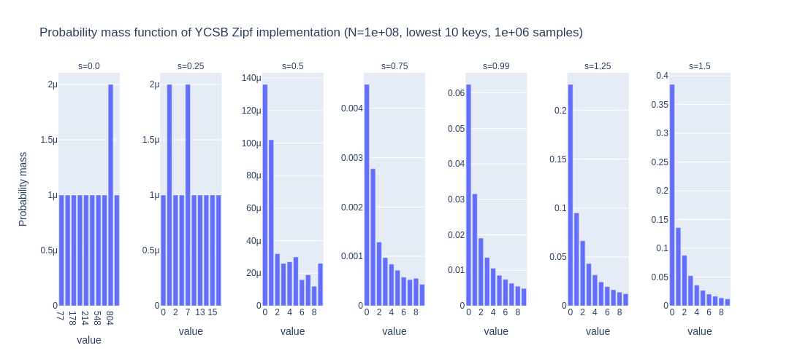
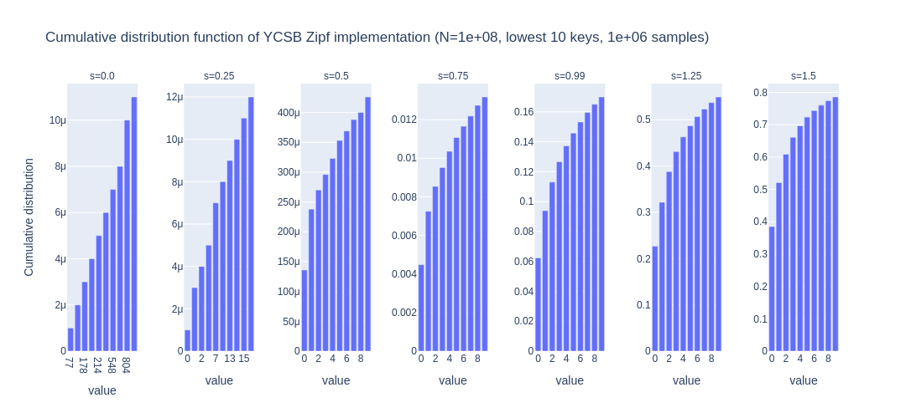

# ycsb

This is a partial port of YCSB's [workload generation logic](https://github.com/brianfrankcooper/YCSB/blob/d9faaac85a95acd4c650a3436ac41eeaeb49c365/core/src/main/java/site/ycsb/workloads/CoreWorkload.java).

Note that we do not support YCSB's [acknowledgement logic](https://github.com/brianfrankcooper/YCSB/blob/d9faaac85a95acd4c650a3436ac41eeaeb49c365/core/src/main/java/site/ycsb/generator/AcknowledgedCounterGenerator.java#L58-L87)
for [insertion operations](https://github.com/brianfrankcooper/YCSB/blob/d9faaac85a95acd4c650a3436ac41eeaeb49c365/core/src/main/java/site/ycsb/workloads/CoreWorkload.java#L862),
as it was a major bottleneck when generating keys for highly concurrent
shared memory workloads.

The Zipfian distribution is a best-effort port of [YCSB's algorithm](https://github.com/brianfrankcooper/YCSB/blob/d9faaac85a95acd4c650a3436ac41eeaeb49c365/core/src/main/java/site/ycsb/generator/ZipfianGenerator.java).
The `examples/zipf.rs` binary can output a CSV of sampled values; the following plots
of the resulting distributions are generated by `plot/zipf.py`.

